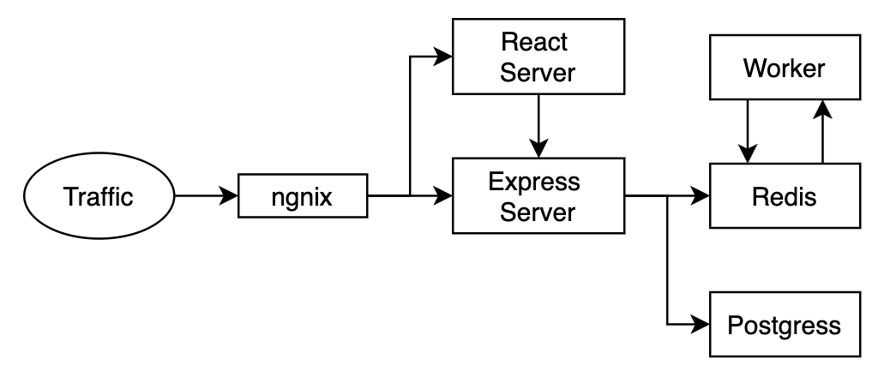
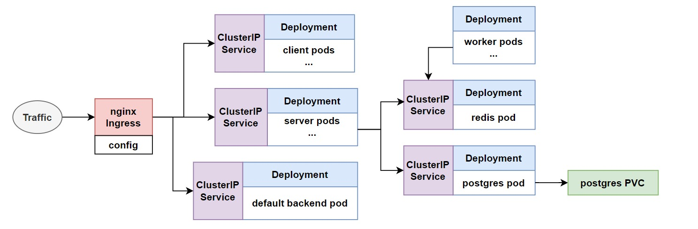

# Kubernetes Project

## Introduction
This repository serves as the project for the Kubernetes course by the Facultad de Ingeniería UdelaR. Within this project, you'll find a web application developed with React that performs real-time calculations of the Fibonacci sequence based on user input.
 
The application is divided into two primary components: a frontend built as a React application and a backend powered by an Express server. The backend includes a specialized worker module that handles the computation of the Fibonacci sequence and stores the results in a Redis database. Moreover, the Express server utilizes a PostgreSQL database to store the historical input values.

The frontend communicates with the backend API, enabling users to access both the current Fibonacci sequence values and the historical input data.

The primary objective of this project is to containerize the application using Docker and deploy it using Kubernetes.

## App Architecture 
This project employs a 3-layer architecture, consisting of the following layers:

1. **Front-end:** This layer is represented by the React app, which serves as the user interface for interacting with the application.

2. **Back-end:** The logic layer is composed of the Express server and the Worker, which handle the application's data processing, and computation of the Fibonacci sequence.

3. **Storage:** The data layer encompasses both the PostgreSQL and Redis databases, where historical input values and computed Fibonacci sequence values are stored, respectively.

<div style="text-align:center">
  
</div>

### Components
1. **Nginx Web Server:** This component routes incoming traffic to various services based on the request type. When accessing the frontend, Nginx directs the request to the React server, and when accessing the backend API, it sends the request to the Express server.

2. **React App (Client):** The frontend of the application, responsible for user interaction.

3. **Express Server:** This server acts as the API layer for the React app, handling requests and responses.

4. **PostgreSQL Database:** This database stores historical input values.

5. **Redis Database:** This database stores the computed Fibonacci sequence values and serves as a queue for the worker to process.

6. **Worker:** This component monitors the next Redis index value and calculates the Fibonacci sequence. Once computed, it stores the results back in Redis. 

## Kubernetes Architecture 

The Kubernetes architecture relies on pods to encapsulate the application containers, promoting scalability and ease of administration. The primary k8 objects utilized are Deployments and Services configured as Cluster IPs.

Deployment objects enable the scaling of client, service, and worker pods as needed. Services, on the other hand, are employed to enable internal network connectivity among the pods. In addition, a Persistent Volume Claim (PVC) is employed for database storage.

Furthermore, the Nginx Ingress Controller serves as the primary gateway for external traffic entering the Kubernetes cluster.  It efficiently handles load balancing and routing, simplifying external access to the cluster's services. This controller also incorporates a default backend for health checks.

<div style="text-align:center">
  
</div>

## Project Component Versions

- **Ingress Nginx Controller** - v1.8.2

- **Redis** - v7.2.2

- **Postgres** - v10.1 

The Ingress Nginx Controller is configured based on the documentation available at:
[Ingress Nginx Quick Start Guide](https://kubernetes.github.io/ingress-nginx/deploy/#quick-start)
  - This documentation provides instructions on deploying and configuring the Ingress Nginx Controller within a Kubernetes environment.

## Getting Started

### Build Docker Images

Build the Docker images:

```bash
`docker build -t <name>/worker:<version> ./worker`

`docker build -t <name>/client:<version> ./client`

`docker build -t <name>/server:<version> ./server`
```

Replace `<name>` with your Docker image repository name and `<version>` with the desired version or tag for your images.

### Push Docker Images

Push the Docker images to your repository:

```bash
`docker push <name>/client:<version>`

`docker push <name>/worker:<version>`

`docker push <name>/server:<version>`
```

## Kubernetes Deployment

To deploy the application on a Kubernetes cluster using `kubectl`:

Apply the Kubernetes configurations in the "k8" folder to create the necessary resources:

```bash
kubectl apply -f k8
```

Check the status of the deployed pods:


```bash
kubectl get pods
```

Check the services to ensure they are up and running:

```bash
kubectl get services
```

Verify the deployments:

```bash
kubectl get deployments
```

Check the Persistent Volume (PV) and Persistent Volume Claim (PVC):
```bash
kubectl get pv
kubectl get pvc
```

To access the application in your web browser, use the following URL:

```bash
http://localhost
```

## Helm Chart

```bash
helm install my-release helm-chart/local-path  --version 1.0.0 # deploy helm charts
helm list --all-namespaces # listing all the releases
heml status <release> # getting status of a release
helm uninstall my-release --keep-history # keep history for rollback
```